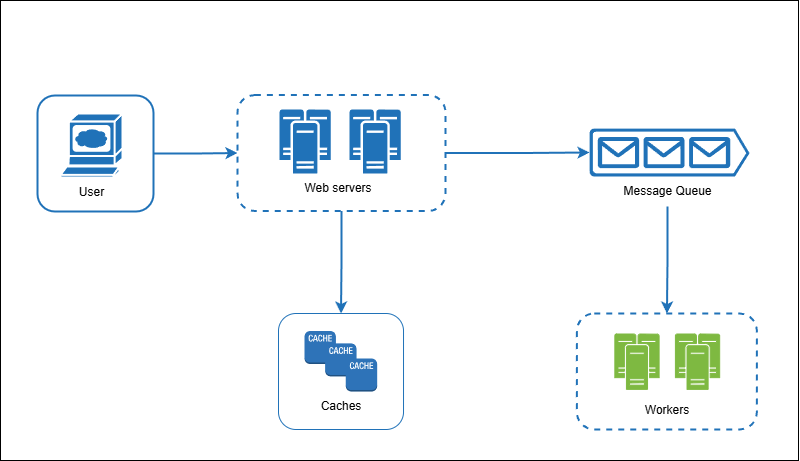
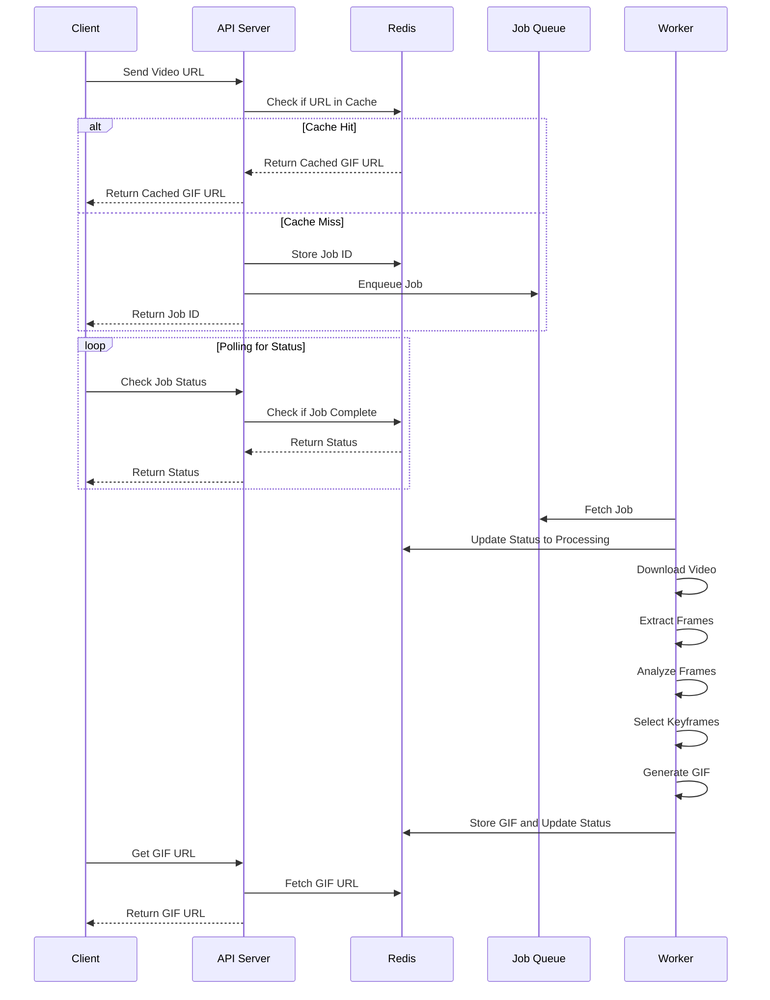

# Project Documentation

This README provides an overview of the project, including its architecture, sequence diagram, and instructions on how to run the application. It is designed for the take-home test interview.

---

## Table of Contents

1. [Demo](#demo)
2. [System Architecture](#system-architecture)
3. [Sequence Diagram](#sequence-diagram)
4. [How to Run the Application](#how-to-run-the-application)

---

## Demo

Below is a video demonstration showcasing the application's functionality and workflow:

[Watch Demo Video](https://drive.google.com/file/d/16lHSXCZxcHSw6GQb0XYSCgGX0mVQx0CE/view?usp=sharing)

---

## System Architecture

Below is the system architecture diagram illustrating the main components and their interactions:



- **User Browser**: Represents the user accessing the application.
- **Web Server**: Handles user requests, job creation, and manages communication with other components.
- **Redis Cache**: Stores processed job results for faster retrieval.
- **Job Queue**: Manages tasks that need to be processed.
- **Thumbnail Workers**: Processes the jobs, including video analysis and GIF creation.

---

## Sequence Diagram

The sequence diagram below demonstrates the workflow of the application from user input to the generation of the GIF:



---

## How to Run the Application

This project uses Docker Compose to simplify deployment. Follow these steps to run the application:

### Prerequisites

- Install [Docker](https://www.docker.com/) and [Docker Compose](https://docs.docker.com/compose/) on your machine.

### Steps to Run

1. Clone the repository:

   ```bash
   git clone https://github.com/your-username/your-repository.git
   cd your-repository
   ```

2. Navigate to the root folder (where the `docker-compose.yml` file is located).

3. Build and start the containers:

   ```bash
   docker-compose up --build
   ```

4. Access the application in your browser at `http://localhost:3000` (adjust the port as needed).

### Stopping the Application

To stop the application, run:

```bash
docker-compose down
```

---

This documentation is subject to updates as the project evolves. Feel free to reach out with questions or issues.
